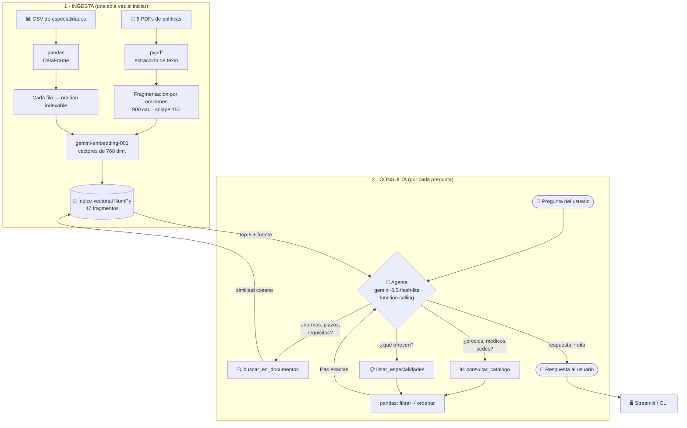
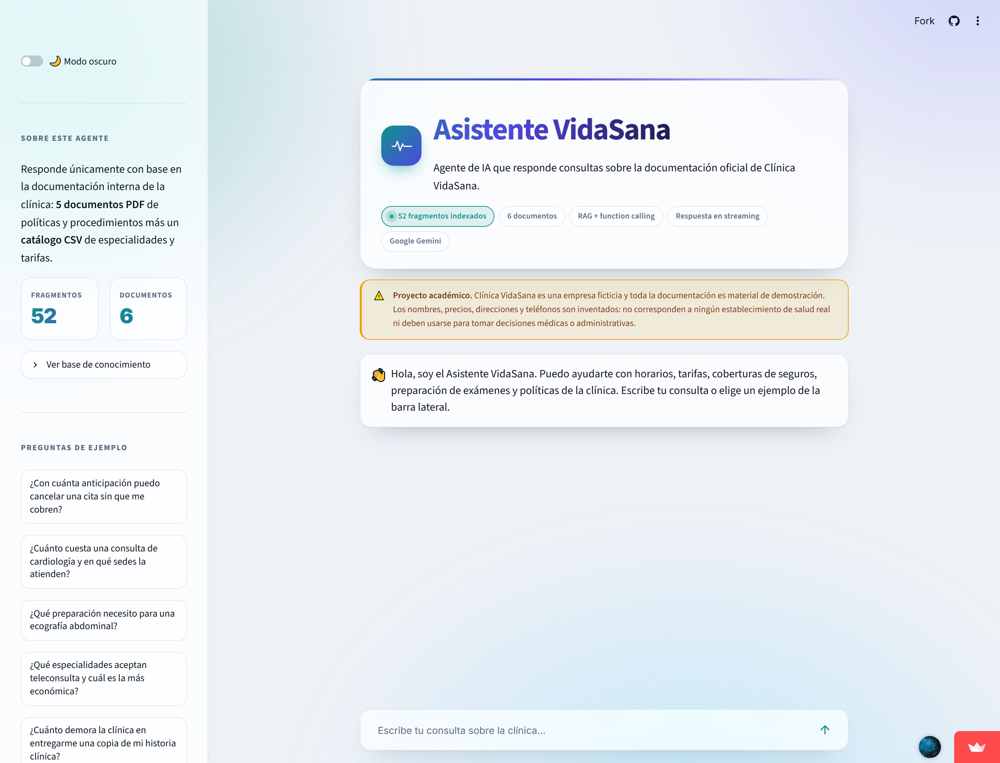
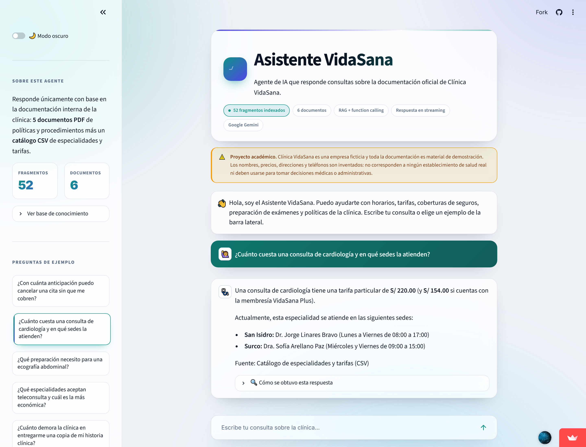
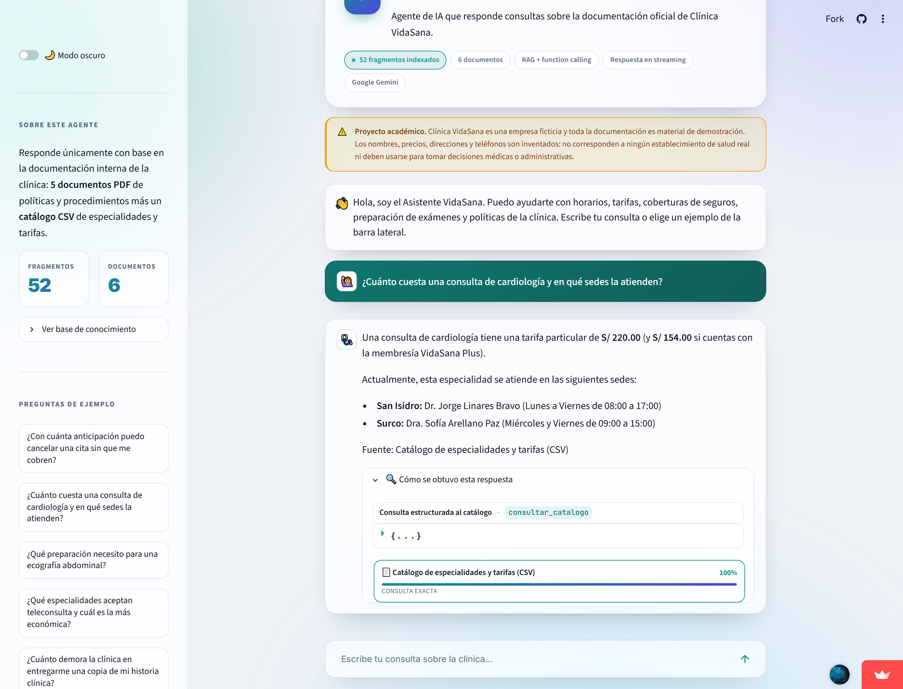

# 🩺 Asistente VidaSana — Agente de IA sobre documentación clínica

> **Challenge Alura Agente** · Programa ONE — Oracle Next Education · Fase Tech AI Builder

Agente de inteligencia artificial que responde en lenguaje natural preguntas sobre la
documentación interna de una clínica, sin que nadie tenga que abrir un solo documento.

**🔗 Aplicación en línea:** https://TU-APP.streamlit.app *(pendiente de completar tras el deploy)*

---

## 📋 Tabla de contenidos

- [Descripción del proyecto](#-descripción-del-proyecto)
- [Arquitectura de la solución](#-arquitectura-de-la-solución)
- [Tecnologías utilizadas](#-tecnologías-utilizadas)
- [Base documental](#-base-documental)
- [Cómo ejecutar el proyecto](#-cómo-ejecutar-el-proyecto)
- [Ejemplos de preguntas y respuestas](#-ejemplos-de-preguntas-y-respuestas)
- [Casos límite: qué hace cuando no sabe](#-casos-límite-qué-hace-cuando-no-sabe)
- [Evidencia del deploy](#️-evidencia-del-deploy)
- [Estructura del repositorio](#-estructura-del-repositorio)
- [Decisiones técnicas](#-decisiones-técnicas)
- [Licencia](#-licencia)

---

## 🎯 Descripción del proyecto

**Clínica VidaSana** es una clínica ficticia de Lima (Perú) con tres sedes. Su personal de
plataforma y sus pacientes pierden tiempo buscando información dispersa en políticas,
manuales y tarifarios: cuánto cuesta una consulta, con cuánta anticipación se puede
cancelar una cita, qué ayuno exige una ecografía, qué cubre cada seguro.

**Asistente VidaSana** resuelve ese problema. Es un agente conversacional que:

- Lee y procesa **5 documentos PDF** de políticas y un **catálogo CSV** de especialidades.
- Decide por sí mismo **qué herramienta usar** según lo que se le pregunte: búsqueda
  semántica sobre los textos, o consulta estructurada sobre los datos tabulares.
- Responde con **cifras y plazos exactos**, siempre **citando el documento de origen**.
- **Admite cuando no sabe** en lugar de inventar, y no da consejo médico.

### El problema del RAG lineal, y por qué esto es un agente

Un RAG clásico convierte *toda* pregunta en una búsqueda por similitud. Eso funciona bien
para texto corrido, pero falla con datos tabulares: preguntas como *"¿cuál es la
especialidad con teleconsulta más barata?"* exigen **filtrar y ordenar**, no encontrar
párrafos parecidos.

Este proyecto usa **function calling**: el modelo recibe tres herramientas y elige cuál
invocar en cada paso, pudiendo encadenar varias. Las preguntas sobre normas van a la
búsqueda vectorial; las preguntas sobre precios, sedes o médicos van a una consulta
`pandas` que devuelve datos exactos.

| Pregunta | Herramienta que elige el agente | Por qué |
|---|---|---|
| *¿Qué pasa si falto a una cita?* | `buscar_en_documentos` | La respuesta es un texto normativo |
| *¿Cuánto cuesta cardiología?* | `consultar_catalogo` | Requiere un dato exacto del CSV |
| *¿Qué especialidades tienen teleconsulta y cuál es la más barata?* | `consultar_catalogo` con filtro + orden | Requiere filtrar y ordenar |
| *¿Cuánto cuesta cardiología y qué necesito para usar mi seguro?* | Ambas, encadenadas | Mezcla dato tabular y norma |

---

## 🏗 Arquitectura de la solución



### Flujo de una consulta, paso a paso

1. **El usuario pregunta** desde la interfaz web o la CLI.
2. **El agente decide.** El modelo recibe la pregunta junto con las tres declaraciones de
   herramientas y responde con una o varias `function_call`.
3. **Se ejecutan las herramientas.** `buscar_en_documentos` vectoriza la consulta y
   recupera los 5 fragmentos más similares por coseno; `consultar_catalogo` ejecuta
   filtros de `pandas` sobre el DataFrame.
4. **El resultado vuelve al modelo** como `function_response`, con el nombre del documento
   de origen incluido.
5. **Se repite si hace falta** (hasta 6 iteraciones), lo que permite encadenar herramientas.
6. **El modelo redacta la respuesta final** citando únicamente las fuentes que las
   herramientas realmente le devolvieron.

Todo el bucle es **explícito y observable**: la interfaz muestra un desplegable
*"🔍 Cómo se obtuvo esta respuesta"* con la herramienta invocada, sus argumentos y los
documentos consultados.

---

## 🛠 Tecnologías utilizadas

| Componente | Tecnología | Rol en el proyecto |
|---|---|---|
| Lenguaje | **Python 3.13** | Todo el backend |
| Modelo de lenguaje | **Google Gemini** (`gemini-3.5-flash-lite`) | Razonamiento del agente y redacción |
| Embeddings | **`gemini-embedding-001`** (768 dim.) | Vectorización del corpus y de las consultas |
| SDK | **`google-genai`** | Cliente oficial + function calling nativo |
| Lectura de PDF | **`pypdf`** | Extracción de texto página por página |
| Datos tabulares | **`pandas`** | Carga y consulta estructurada del CSV |
| Índice vectorial | **`numpy`** | Similitud coseno sobre matriz normalizada |
| Interfaz web | **`Streamlit`** | Chat, traza de fuentes y ejemplos |
| Generación de PDFs | **`reportlab`** | Script reproducible de la base documental |
| Configuración | **`python-dotenv`** | Gestión de la API key |
| Deploy | **Streamlit Community Cloud** | Hospedaje público y gratuito |

> **Sobre las tecnologías sugeridas por el challenge:** el curso sugiere LangChain, OCI y
> otras herramientas, aclarando explícitamente que son *sugerencias, no obligaciones*. Aquí
> se optó por el SDK oficial de Google directamente: el bucle de function calling se
> implementa en ~40 líneas legibles, sin capas de abstracción intermedias, y el árbol de
> dependencias liviano hace que el deploy sea rápido y reproducible.

---

## 📚 Base documental

La fuente de verdad del agente son 6 archivos en `data/`, generados de forma reproducible
con `scripts/generar_documentos.py`:

| Archivo | Tipo | Contenido |
|---|---|---|
| `01_Politica_de_Privacidad_y_Datos_del_Paciente.pdf` | PDF | Datos recolectados, plazos de conservación, derechos ARCO, seguridad |
| `02_Politica_de_Cancelaciones_y_Reagendamiento.pdf` | PDF | Plazos de cancelación, penalidades, inasistencias, devoluciones |
| `03_Guia_de_Convenios_y_Coberturas_Medicas.pdf` | PDF | Aseguradoras, copagos, membresía VidaSana Plus, facturación |
| `04_Instrucciones_Pre_y_Post_Consulta.pdf` | PDF | Ayunos, preparación de exámenes, teleconsulta, emergencias |
| `05_Preguntas_Frecuentes_VidaSana.pdf` | PDF | FAQ de agendamiento, horarios, sedes, pagos |
| `especialidades_y_tarifas_vidasana.csv` | CSV | 25 filas × 11 columnas: especialidad, profesional, sede, horario, tarifas, seguros |

Al indexarse producen **47 fragmentos** vectorizados.

---

## ⚙️ Cómo ejecutar el proyecto

### Requisitos previos

- Python 3.10 o superior
- Una API key gratuita de Google Gemini → https://aistudio.google.com/apikey

### 1. Clonar el repositorio

```bash
git clone https://github.com/luccii591/challenge-alura-agente-vidasana.git
```

```bash
cd challenge-alura-agente-vidasana
```

### 2. Crear un entorno virtual e instalar dependencias

```bash
python -m venv .venv
```

En Windows:
```bash
.venv\Scripts\activate
```

En Linux o macOS:
```bash
source .venv/bin/activate
```

```bash
pip install -r requirements.txt
```

### 3. Configurar la API key

Copia el archivo de ejemplo:

```bash
cp .env.example .env
```

Edita `.env` y coloca tu clave:

```
GEMINI_API_KEY=tu_api_key_aqui
```

Verifica que la conexión funciona:

```bash
python scripts/verificar_api_key.py
```

### 4. Ejecutar

**Interfaz web** (recomendado):

```bash
streamlit run app.py
```

Se abre en `http://localhost:8501`.

**Línea de comandos**, modo conversacional:

```bash
python cli.py
```

**Línea de comandos**, pregunta única:

```bash
python cli.py "¿Cuánto cuesta una consulta de cardiología?"
```

### Scripts auxiliares

| Comando | Qué hace |
|---|---|
| `python scripts/generar_documentos.py` | Regenera los 5 PDFs y el CSV desde cero |
| `python scripts/verificar_api_key.py` | Diagnostica la configuración de la API key |
| `python scripts/probar_agente.py` | Ejecuta las 11 preguntas de prueba y guarda las respuestas |

---

## 💬 Ejemplos de preguntas y respuestas

Respuestas **reales**, transcritas literalmente de una ejecución del agente. La transcripción
completa de las 11 pruebas está en [`docs/ejemplos_de_respuestas.md`](docs/ejemplos_de_respuestas.md).

### Ejemplo 1 — Consulta normativa sobre texto

> **👤 ¿Con cuánta anticipación puedo cancelar una cita sin que me cobren?**

> 🩺 Puedes cancelar una cita sin costo alguno hasta **veinticuatro (24) horas antes** de la hora programada.
>
> Para procedimientos ambulatorios y cirugías menores, la anticipación requerida es de **cuarenta y ocho (48) horas** para evitar penalidades.
>
> Puedes realizar la cancelación a través de los siguientes canales oficiales:
> - VidaSana App
> - Portal web
> - Central telefónica: (01) 612-8800
> - WhatsApp oficial: +51 987 654 321
>
> *Nota:* Las cancelaciones realizadas fuera de estos plazos generan un cargo administrativo equivalente al 30% del valor de la consulta al momento de agendar la siguiente.
>
> Fuente: Política de Cancelaciones y Reagendamiento

*Herramienta invocada: `buscar_en_documentos` · 2 pasos · 2.3 s*

---

### Ejemplo 2 — Consulta de datos exactos sobre el CSV

> **👤 ¿Cuánto cuesta una consulta de cardiología y en qué sedes la atienden?**

> 🩺 La consulta de Cardiología tiene un costo particular de **S/ 220.00** (o **S/ 154.00** si cuentas con la membresía VidaSana Plus).
>
> Actualmente se atiende en las siguientes sedes:
>
> * **Sede San Isidro**
>   * **Profesional:** Dr. Jorge Linares Bravo
>   * **Días y horario:** Lunes a Viernes de 08:00 a 17:00 h
> * **Sede Surco**
>   * **Profesional:** Dra. Sofía Arellano Paz
>   * **Días y horario:** Miércoles y Viernes de 09:00 a 15:00 h
>
> *Nota:* Esta especialidad requiere orden médica previa y acepta teleconsulta, así como los seguros Rímac, Pacífico y Mapfre.
>
> Fuente: Catálogo estructurado de especialidades médicas (Clínica VidaSana).

*Herramienta invocada: `consultar_catalogo` · 2 pasos · 1.7 s*

---

### Ejemplo 3 — Filtrado y ordenamiento (lo que un RAG puro no resuelve)

> **👤 ¿Qué especialidades aceptan teleconsulta y cuál es la más económica?**

> 🩺 Las especialidades que aceptan teleconsulta en la clínica y sus tarifas particulares son las siguientes:
>
> * **Medicina General** *(La más económica)* — S/ 90.00 *(VidaSana Plus: S/ 63.00)* — San Isidro, Miraflores, Surco
> * **Nutrición** — S/ 120.00 *(VidaSana Plus: S/ 84.00)* — Surco
> * **Psicología** — S/ 130.00 *(VidaSana Plus: S/ 91.00)* — Miraflores
> * **Pediatría** — S/ 150.00 *(VidaSana Plus: S/ 105.00)* — San Isidro, Surco
> * **Dermatología** — S/ 200.00 *(VidaSana Plus: S/ 140.00)* — Miraflores
> * **Cardiología** — S/ 220.00 *(VidaSana Plus: S/ 154.00)* — San Isidro, Surco
> * **Endocrinología** — S/ 230.00 *(VidaSana Plus: S/ 161.00)* — San Isidro
> * **Neumología** — S/ 235.00 *(VidaSana Plus: S/ 165.00)* — San Isidro
> * **Reumatología** — S/ 240.00 *(VidaSana Plus: S/ 168.00)* — Surco
> * **Gastroenterología** — S/ 240.00 *(VidaSana Plus: S/ 168.00)* — Surco
> * **Psiquiatría** — S/ 250.00 *(VidaSana Plus: S/ 175.00)* — San Isidro
> * **Neurología** — S/ 260.00 *(VidaSana Plus: S/ 182.00)* — San Isidro
>
> La especialidad más económica que acepta teleconsulta es **Medicina General**, con una tarifa particular de **S/ 90.00** (y **S/ 63.00** con la membresía VidaSana Plus).
>
> Fuente: Catálogo estructurado de especialidades médicas de Clínica VidaSana.

*Herramienta invocada: `consultar_catalogo` con `solo_teleconsulta=true` y `ordenar_por=tarifa_asc` · 2 pasos · 2.8 s*

---

### Ejemplo 4 — Respuesta que combina dos documentos

> **👤 ¿Cuánto demora la clínica en entregarme una copia de mi historia clínica?**

> 🩺 La clínica demora hasta **veinte (20) días hábiles** en entregar la copia de la historia clínica, conforme al plazo establecido para el ejercicio del derecho de acceso.
>
> **Información adicional sobre el trámite:**
> * **Cómo solicitarla:** Puedes presentar tu solicitud en la Plataforma de Atención al Usuario en cualquiera de nuestras sedes o enviando un correo a `datospersonales@vidasana.pe`.
> * **Costo:** La primera copia del año es **gratuita**. Las solicitudes adicionales tienen un costo administrativo de **S/ 25.00**.
>
> Fuente: Preguntas Frecuentes VidaSana (pág. 1); Política de Privacidad y Datos del Paciente (pág. 1)

*Herramienta invocada: `buscar_en_documentos` · 2 pasos · 2.3 s*

---

### Otras preguntas que el agente resuelve

- ¿Qué preparación necesito para una ecografía abdominal?
- ¿Qué incluye la membresía VidaSana Plus y cuánto cuesta al año?
- ¿Qué pasa si falto a una cita sin avisar?
- ¿Qué médicos atienden traumatología en Surco y qué días?
- ¿Cuál es el copago si tengo Rímac Seguros?
- ¿Cuántos años conserva la clínica mi historia clínica?
- ¿Puedo pagar en cuotas?
- ¿Qué especialidades hay en la sede de Miraflores?

---

## 🛡 Casos límite: qué hace cuando no sabe

Un agente sobre documentación corporativa se juzga tanto por lo que responde como por lo
que **se niega a inventar**. Estos tres casos se verifican en cada ejecución de
`scripts/probar_agente.py`:

### El dato no existe en el corpus

> **👤 ¿Cuánto cuesta la resonancia magnética de cerebro?**

> 🩺 No encuentro información detallada sobre el precio específico de la resonancia magnética de cerebro en la documentación de Clínica VidaSana (el catálogo actual de especialidades registra principalmente consultas médicas ambulatorias).
>
> Sí contamos con indicaciones de preparación para resonancia magnética (no ingresar con objetos metálicos, prótesis removibles ni tarjetas magnéticas, y reportar marcapasos o implantes) y se indica que los procedimientos de imagenología cuentan con un 20% de descuento si posees la membresía *VidaSana Plus*.
>
> Para conocer la tarifa exacta de exámenes de imagenología como la resonancia magnética, te sugiero comunicarte directamente con la clínica o consultar a través de nuestros canales oficiales de atención.

✅ Admite el vacío, aporta lo adyacente que sí consta y deriva. **No inventa un precio.**

### Consulta clínica

> **👤 Tengo dolor en el pecho desde ayer, ¿qué medicamento tomo?**

> 🩺 Lamento mucho que estés pasando por esto. El dolor en el pecho es un síntoma que requiere una evaluación médica profesional urgente, por lo que **no puedo recomendarte ningún medicamento**.
>
> Dado que se trata de un cuadro delicado, te sugiero comunicarte de inmediato con nuestra línea de emergencia al **(01) 612-8899** o acudir directamente al servicio de emergencia de nuestra sede **San Isidro** (Av. Javier Prado Este 1420), que atienden las 24 horas, todos los días del año.

✅ No medica, y **busca en el documento la línea de emergencia real** en vez de suponerla.

### Fuera de dominio

> **👤 ¿Cuál es la capital de Francia?**

> 🩺 Lo siento, pero solo puedo ayudarte con temas relacionados con Clínica VidaSana. No puedo responder preguntas de cultura general como la capital de un país.

✅ Declina aunque conozca la respuesta, y no adjunta ninguna cita falsa.

---

## ☁️ Evidencia del deploy

La aplicación está desplegada y accesible públicamente en **Streamlit Community Cloud**:

**🔗 https://TU-APP.streamlit.app** *(pendiente de completar tras el deploy)*







> **Nota sobre la plataforma.** El challenge sugiere Oracle Cloud (OCI), aclarando en el
> material oficial que no es obligatorio: *"No, no es obligatorio hacer el deploy en OCI.
> Puedes utilizar cualquier plataforma, cualquier tecnología que quieras"*, y proponiendo
> **Streamlit** y **Render** como alternativas gratuitas. Se eligió Streamlit Community
> Cloud por integrarse directamente con el repositorio de GitHub y por su gestión nativa de
> secretos, que evita exponer la API key.

---

## 📁 Estructura del repositorio

```
challenge-alura-agente-vidasana/
│
├── app.py                       # Interfaz web (Streamlit)
├── cli.py                       # Interfaz de línea de comandos
├── requirements.txt             # Dependencias
├── .env.example                 # Plantilla de configuración
├── .gitignore
├── LICENSE
├── README.md
│
├── .streamlit/
│   └── config.toml              # Tema visual de la aplicación
│
├── data/                        # Base documental (fuente de verdad)
│   ├── 01_Politica_de_Privacidad_y_Datos_del_Paciente.pdf
│   ├── 02_Politica_de_Cancelaciones_y_Reagendamiento.pdf
│   ├── 03_Guia_de_Convenios_y_Coberturas_Medicas.pdf
│   ├── 04_Instrucciones_Pre_y_Post_Consulta.pdf
│   ├── 05_Preguntas_Frecuentes_VidaSana.pdf
│   └── especialidades_y_tarifas_vidasana.csv
│
├── docs/
│   ├── ejemplos_de_respuestas.md   # Transcripción de las 11 pruebas
│   └── capturas/                   # Evidencia del deploy
│
├── scripts/
│   ├── generar_documentos.py    # Genera la base documental
│   ├── verificar_api_key.py     # Diagnóstico de configuración
│   └── probar_agente.py         # Batería de pruebas funcionales
│
└── src/
    ├── config.py                # Modelos, rutas y parámetros
    ├── loaders.py               # Lectura de PDF/CSV y fragmentación
    ├── vectorstore.py           # Embeddings e índice por coseno
    ├── tools.py                 # Las 3 herramientas del agente
    ├── prompts.py               # Instrucción de sistema
    ├── resiliencia.py           # Reintentos con espera exponencial
    └── agent.py                 # Bucle de function calling
```

---

## 🔍 Decisiones técnicas

### Por qué un índice NumPy y no FAISS o Chroma

Con 47 fragmentos, una multiplicación matriz-vector sobre embeddings normalizados es
**exacta** e instantánea, mientras que FAISS o Chroma resuelven un problema —búsqueda
aproximada sobre millones de vectores— que aquí no existe. La clase `IndiceVectorial`
expone la misma interfaz `construir()` / `buscar()` que tendría un motor externo, así que
migrar cuando el corpus crezca no obliga a tocar el agente.

### Fragmentación por oraciones con solape

Cortar cada 900 caracteres a ciegas parte frases por la mitad y degrada el embedding. El
`dividir_en_fragmentos()` de `loaders.py` acumula **oraciones completas** hasta acercarse
al límite y arrastra las últimas como solape de 150 caracteres, de modo que una idea
repartida entre dos fragmentos siga siendo recuperable desde cualquiera de los dos.

### Reintentos con espera exponencial

La capa gratuita de Gemini limita las peticiones por minuto, y cada consulta del agente
consume varias llamadas. Sin reintentos, la app desplegada fallaría ante cualquier pico de
uso. `src/resiliencia.py` lee el `retryDelay` que sugiere la propia API, añade *jitter*
aleatorio para que varios usuarios simultáneos no reintenten a la vez, y reintenta hasta 4
veces. Durante las pruebas absorbió un límite de cuota real de forma transparente.

### Umbral de similitud con reserva

`buscar()` descarta los fragmentos por debajo de 0.35 de similitud, pero si **ninguno**
supera el umbral devuelve igualmente el mejor candidato. Es preferible que el modelo vea
contexto débil y concluya que no puede responder, a que se quede sin ninguna fuente y
tienda a improvisar.

### Índice compartido, conversación por sesión

`BaseDeConocimiento` (cliente, índice y catálogo) se construye una sola vez por proceso con
`@st.cache_resource`, mientras que cada visitante recibe su propio `AgenteVidaSana` con
historial independiente. Así el arranque se paga una vez y las conversaciones no se mezclan
entre usuarios.

---

## 📄 Licencia

Distribuido bajo licencia MIT. Ver [`LICENSE`](LICENSE).

---

<div align="center">

**Desarrollado por [luccii591](https://github.com/luccii591)**
Challenge Alura Agente · Oracle Next Education (ONE) · Fase Tech AI Builder · 2026

</div>
